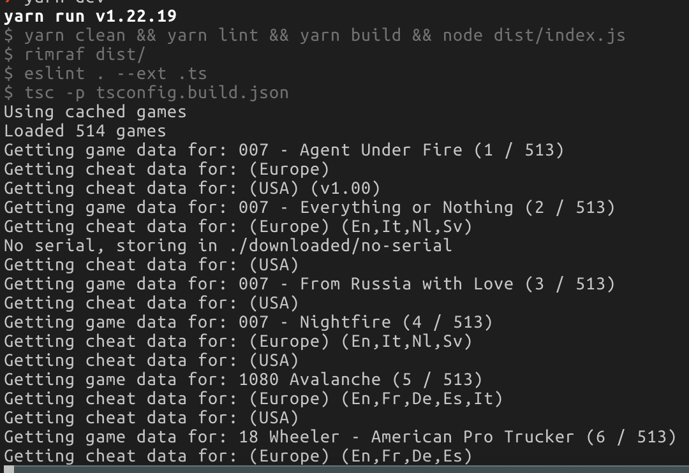

# GameHacking.org Cheat Scraper

This Typescript project scrapes the GameHacking.org website for cheats and exports them to swiss-ready text based cheat files.

## Why?

No bulk export option make angry

## How to use

1. Clone this repo
2. Run `yarn`
3. Run `yarn dev
4. Wait
