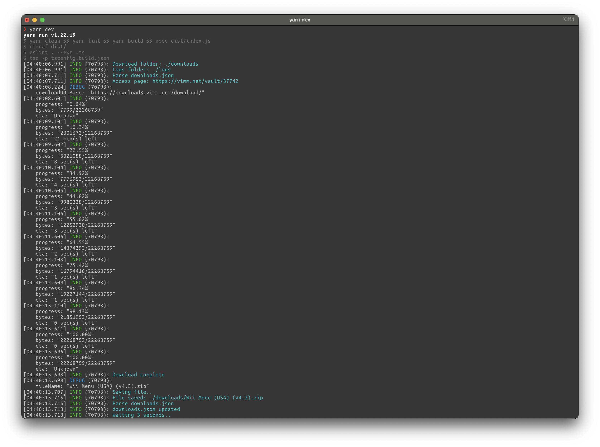

# Vimm Download Manager

This Typescript project downloads specified files from Vimm's Lair one after the other. It uses Puppeteer to scrape the site for links, then downloads files with axios.
This was done because Vimm's Lair does not have a bulk download option, offer torrents, and during sane hours (read: not 4 AM central time) has download speeds of around 500Kb/s.

## How to use

1. Clone this repo
2. Run `yarn`
3. Run `yarn dev
4. Wait

-- OR --

1. Have docker
2. Run `docker run -it --rm --cap-add=SYS_ADMIN -v $(pwd)/downloaded:/app/downloads ghcr.io/maxwlang/vimm-download-manager:<release tag>`

## Environment Variables

| Variable                       | Description                                                               | Default       | Example                    |
| ------------------------------ | ------------------------------------------------------------------------- | ------------- | -------------------------- |
| `NODE_ENV`                     | The environment of the script, if production console output will be json. | N/A           | `production`               |
| `VIMM_SCRAPER_LOG_LEVEL`       | Pino log level                                                            | `info`        | `debug`                    |
| `VIMM_SCRAPER_DOWNLOAD_FOLDER` | The folder to download files to. Default is relative to app dir.          | `./downloads` | `/opt/tank/vimm/downloads` |
| `VIMM_SCRAPER_LOGS_FOLDER`     | The folder to save logs to. Default is relative to app dir.               | `./logs`      | `/opt/tank/vimm/logs`      |
